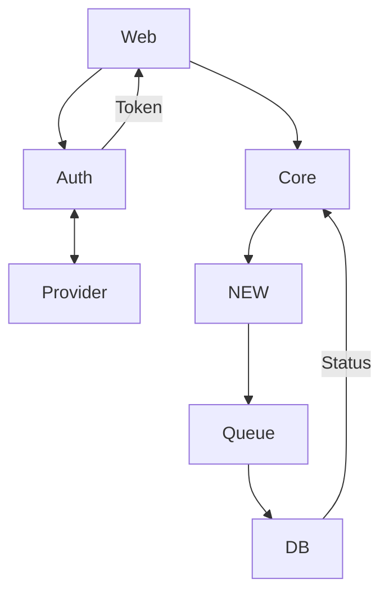

## Clients

- Web

## Services

- Core
- Auth

## Flow

When a writter publish an article, it will be added to the `Feed` table that each user has, whe a user views a post it will automatically be removed from the `Feed` table and will increase a view counter in the original post

## Data

### User

| Field      | Type      | Description        |
| ---------- | --------- | ------------------ |
| id         | int       | User ID            |
| email      | string    | User email         |
| created_at | timestamp | User creation date |
