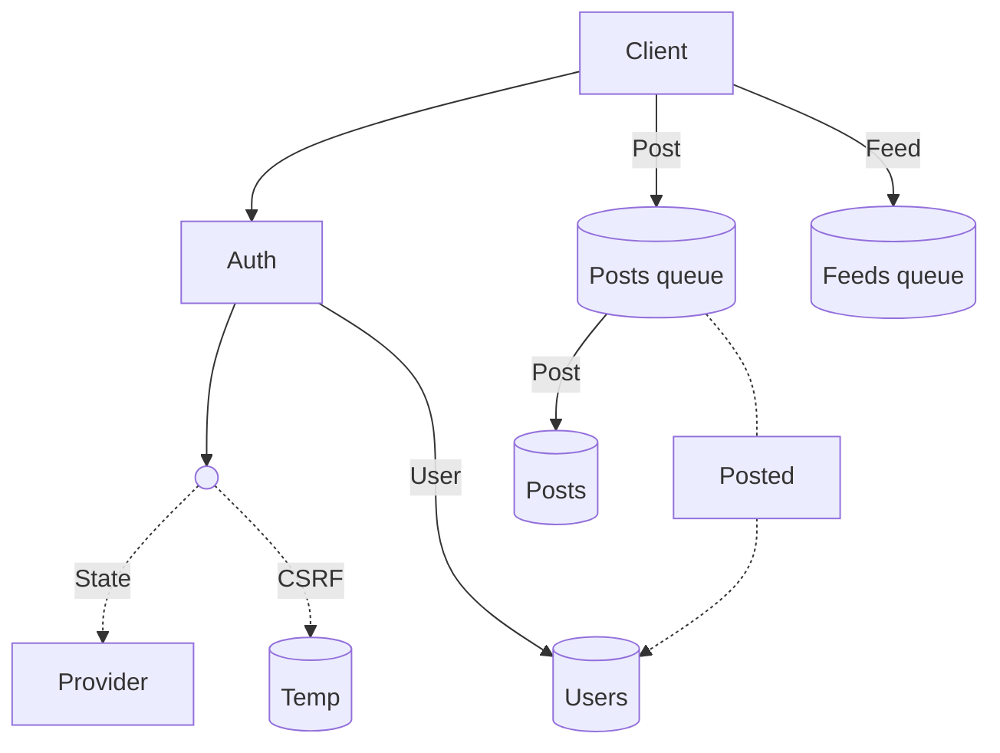

# Notes :)

Just hacking around with some ideas.

## Architecture

> Note: ! = Ongoing, ? = Maybe, ~ = Next

### Clients

- ! Web
- ? Mobile

### Services

- ~ Core
- ! Auth
- ~ Feed

## Flow

A generalized flow of the system.

## Data

Just some basic data structures, for visualization purposes.

### User

| Field      | Type      | Description        |
| ---------- | --------- | ------------------ |
| id         | int       | User ID            |
| email      | string    | User email         |
| created_at | timestamp | User creation date |

## TODOs

- [x] Better error handling

## Stack

Tech I'm using or planning to use.

### Client

Those are the platforms I'm planning to support.

- Web
  - [Next.js](https://nextjs.org/)
  - [Tailwind CSS](https://tailwindcss.com/)

### Service

And these are the main services I'm planning to use.

- Auth
  - [OAuth 2](https://oauth.net/2/)
    - Providers: GitHub, Discord, Spotify.
  - [Redis](https://redis.io/)
    - For storing temporary data.

- User
  - [Neo4j](https://neo4j.com/)
    - For storing user data and provide user relations.

- Posts
  - [MeiliSearch](https://www.meilisearch.com/)
    - For full-text search + storing posts data.

- Feed
  - [RabbitMQ](https://www.rabbitmq.com/)
    - For queueing posts on user feeds.
